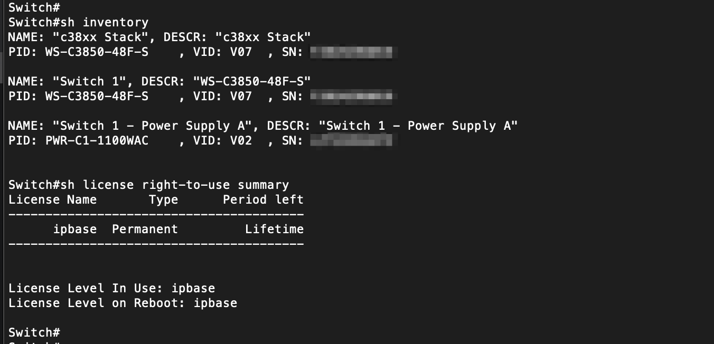
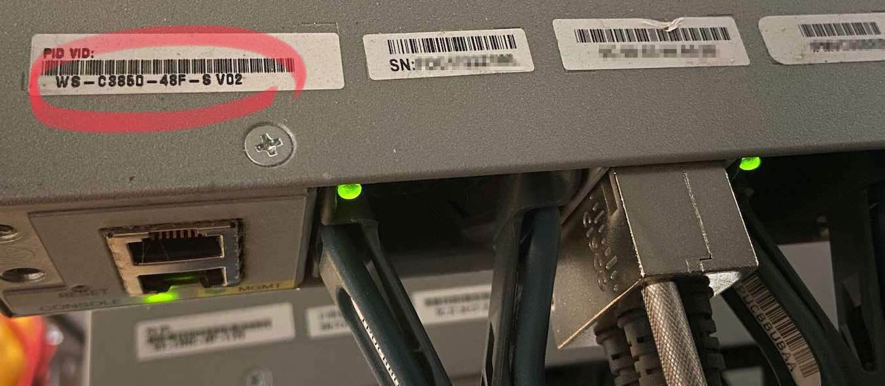
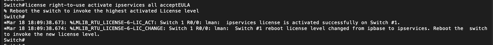
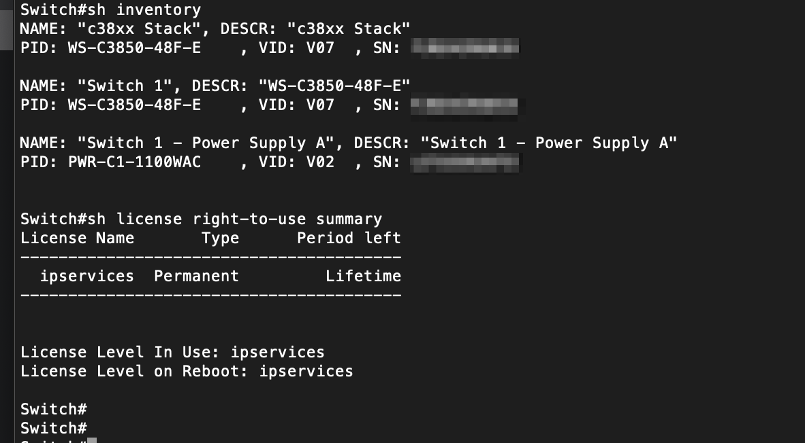

When the licensing is updated on certain Cisco switches, the reported
model number also changes.  One of my coworkers ran into this issue
recently while trying to coordinate an RMA with TAC for a 3850 switch.
He replicated this in the lab and sent me some screenshots of his
terminal session to document what he saw.  I thought I'd share it here
to help others.

Out of the box, with the `ipbase` license, the switch shows up as an "-S" model.

This matches the physical sticker on the back of the unit.

Then, he activated a different license, `ipservices`.

With no other changes, the switch now reports that it is an "-E" model.

