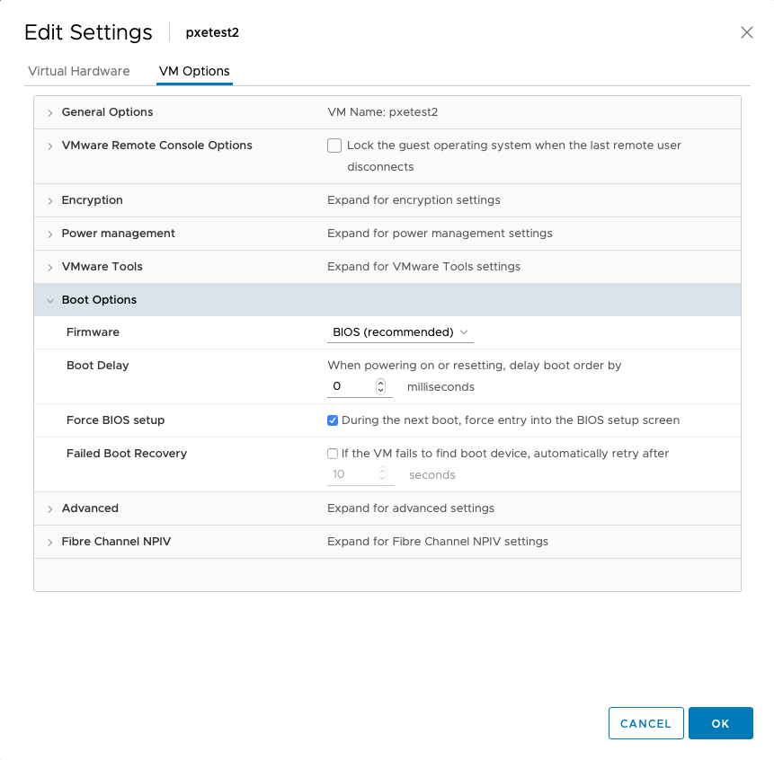
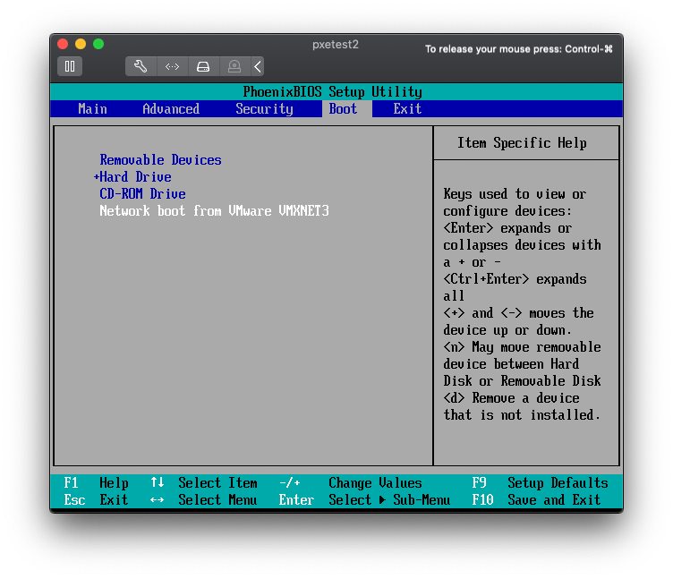
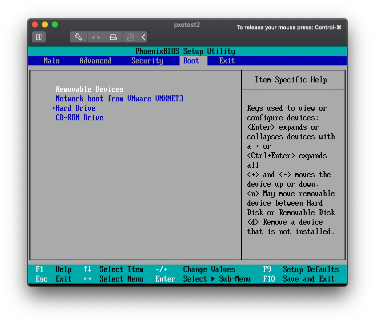
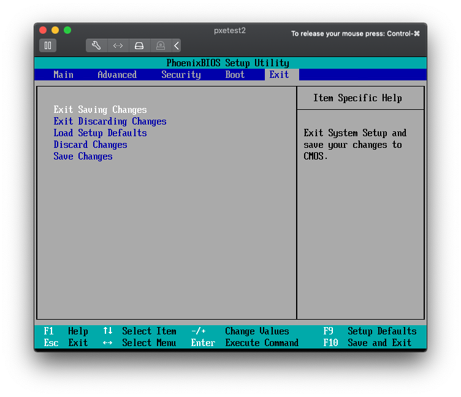

By default VMware virtual machines only PXE boot on first install.  Once
an operating system has been installed on the hard drive, it will boot
that and never try to network boot again.  This is due to the default
BIOS boot order.  By changing the boot order, they can be configured to
try a network boot first and after a short timeout boot from disk.

In the vSphere client, find the VM in question, and chose `Edit
Settings`.  Under `VM Options`, expand `Boot Options` and enable the
"Force BIOS setup" option.



Connect to the console and reboot the VM.  It should now boot directly
into the BIOS Setup Utility.  Use the arrow keys to navigate to the
`Boot` menu.  Note that "Hard Drive" is listed before "Network Boot".



Use the arrow keys to highlight the "Network boot" item and then the `+`
key move it above the "Hard Drive" item.



Move to the `Exit` menu and press `Enter` to "Exit Saving Changes".



Now, every time the VM boots, it will first network boot.  If
that fails, it will then boot the disk normally.  Configure your
PXE server to continue booting to the hard drive after a short
timeout if there is no user interaction.  This is typically the
default configuration for most setups; the relevant part of our
[pxelinux](https://wiki.syslinux.org/wiki/index.php?title=PXELINUX)
configuration that does this:

```plaintext
TIMEOUT 50
ONTIMEOUT local

[...]

LABEL local
  MENU LABEL Boot first hard drive
  LOCALBOOT 0
```

Unfortunately, this whole process is manual.  I'd like to know if there
is a programmatic way to make these changes.  The best I've come up
with is to do this manually to one virtual machine, and use that as a
template for future VMs.
