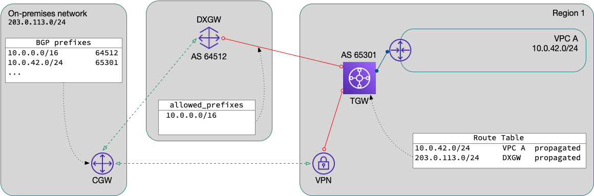
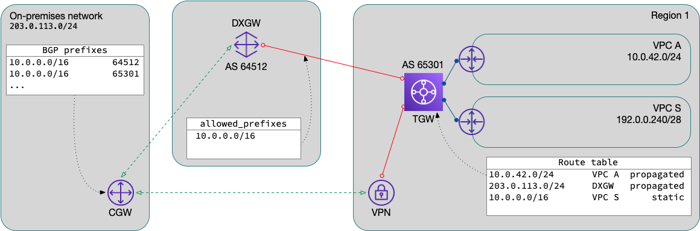

## The problem

A [common AWS connectivity design][design] is to have a direct connect
(DX) connection with a VPN backup.  There are some routing concerns
to consider when implementing this design to make sure that traffic
prefers the DX circuit and only uses the backup VPN path if the DX is
unavailable.  Traffic _from_ AWS transit gateway (TGW) will always
prefer the direct connect gateway (DXGW) path, but traffic in the other
direction (_to_ AWS) is dependent on the customer gateway (CGW) routing
policy.

Typically, the TGW association with the DXGW is configured with the
`allowed_prefixes` aggregate network in order to summarize all the VPC
networks attached to that TGW.  In this configuration, the DXGW will
only advertise these prefixes listed in the on-premises network.  The
problem arises in that the VPN connects to the TGW and will propagate
all of the more specific VPC routes to the on-premises network.  Due to
[longest prefix match][longest-prefix], the CGW will prefer the VPN
path (without any additional configuration).

A simplified network diagram showing this routing issue:



## The solution

In order to fix this, we need to:

1. advertise the same aggregate prefix(es) over the VPN
2. filter out the more-specific prefix(es) at the CGW
3. set a local metric at the CGW to prefer the DXGW prefix(es)

### Advertise aggregate network over VPN

By [adding a static route][static route] in the TGW route table to
which the VPN is attached, the route will be advertised to the CGW.
Unfortunately, you cannot use a blackhole route here as those are not
advertised.  The only way I've found to do this is to this is to either
use an existing VPC as the route's target, or create a dedicated summary
VPC just for this purpose.

[static route]: https://docs.aws.amazon.com/cli/latest/reference/ec2/create-transit-gateway-route.html

### Filter more-specifics

At this point, the CGW should see the aggregate prefix from both
the DXGW and the TGW via VPN.  Note that these prefixes will have a
different origin AS, which may assist in writing your route policy.  You
could also filter at the neighbor configuration, or in redistribution
into your IGP, depending on the network topology.

### Prefer the DXGW path

Now that we have both routes with the same prefix length, we can
influence the route selection using a local metric.  This will vary
depending on your existing network, but here's an example policy to
apply to the BGP peers:

```rpl
prefix-set aws-networks
  10.0.0.0/16
end-set
!
route-policy aws-in
  if (destination in aws-networks and as-path originates-from '64512' ) then
    set local-preference 200
  elseif destination in aws-networks then
    set local-preference 100
  else
    drop
  endif
end-policy
```

Once that is complete, the direct connect circuit will be preferred
and the VPN path will only be used as backup.



[design]: https://docs.aws.amazon.com/whitepapers/latest/hybrid-connectivity/vpn-connection-as-a-backup-to-aws-dx-connection-example.html
[longest-prefix]: https://en.wikipedia.org/wiki/Longest_prefix_match
