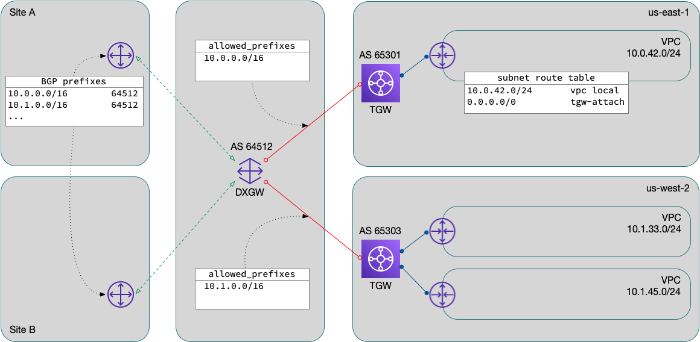
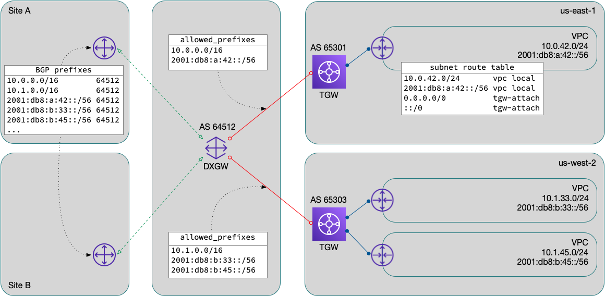

## Introduction

AWS has made much progress over the years with IPv6 support.  From
[S3][S3 IPv6], [EC2][EC2 IPv6], [Cloudfront][Cloudfront IPv6],
[Route53][Route53 IPv6], and [EC2][EC2 IPv6] support back in 2016, to
more recent updates to [NLB][NLB IPv6] and the [EC2 API][API IPv6],
I've appreciated every advancement and patiently waited for the next.
Unfortunately, there are still pieces missing that prevent me from
making full use of IPv6 in my employer's current environment.

[S3 IPv6]: https://aws.amazon.com/blogs/aws/now-available-ipv6-support-for-amazon-s3/
[EC2 IPv6]: https://aws.amazon.com/blogs/aws/new-ipv6-support-for-ec2-instances-in-virtual-private-clouds/
[Cloudfront IPv6]: https://aws.amazon.com/blogs/aws/ipv6-support-update-cloudfront-waf-and-s3-transfer-acceleration/
[Route53 IPv6]: https://aws.amazon.com/about-aws/whats-new/2016/10/amazon-route-53-now-supports-dns-queries-over-ipv6-networks/
[EC2 IPv6]: https://aws.amazon.com/blogs/aws/new-ipv6-support-for-ec2-instances-in-virtual-private-clouds/
[NLB IPv6]: https://aws.amazon.com/about-aws/whats-new/2020/11/network-load-balancer-supports-ipv6/
[API IPv6]: https://aws.amazon.com/about-aws/whats-new/2021/01/amazon-ec2-api-supports-internet-protocol-version-6/

## Existing architecture

The architecture is modeled after one of AWS's [recommended connectivity
designs][design].  VPCs attach to a per-region transit gateway (TGW)
for access to each other, shared services, on-prem network, our Azure
VNets, and Internet access.  In practice, a set of TGW route tables
(common, campus, etc.) allow association and propagation with and to
these various routes.

The connectivity to on-prem (and Azure) is via AWS's Direct Connect
service.  Each regional TGW connects to the Direct Connect gateway (DXGW)
using a TGW Association.   Transit VIFs are provisioned from the DXGW
to each DX router.

In the interests of simplification, I've omitted or changed many
components and other details such as VPN backup, Direct Connect provider
infrastructure, IP addressing, and on-prem networking.

[design]: https://docs.aws.amazon.com/whitepapers/latest/hybrid-connectivity/aws-dx-dxgw-with-aws-transit-gateway-multi-regions-and-aws-public-peering.html

## Routing

Traffic *from* the VPC is statically routed with entries for either
`0.0.0.0/0` or more specific prefixes and a destination of the TGW
attachment in each subnet's route table.  Traffic *to* the VPC is
controlled by the propagation of the VPC's CIDR blocks to one or more
TGW route tables.

Routing between the DXGW and on-prem uses BGP.  The DXGW is a global
construct, and has its own ASN.  Each regional TGW also has a unique
ASN.  But, there is no dynamic routing between the TGW and the DXGW.
The TGW association has an attribute, `allowed_prefixes`, which is a
list of networks serviced by the TGW.  These networks are injected into
the DXGW route table and propagated to the rest of the network via BGP.

There is a scaling limitation here: `allowed_prefixes` is (currently)
limited to 20 prefixes (per association).  Listing each VPC's CIDR block
here would unnecessarily limit the number of VPCs you could effectively
attach.  Fortunately, a sane IPv4 addressing plan allows us to summarize
these networks on a per-region basis.

## IPv6 is different

Note that I said sane *IPv4* addressing plan.  This is not the case
for IPv6.  With IPv4, using RFC1918 address space, we were able to
pre-allocate blocks based on our planned expansion and growth.  With
IPv6, all addressing is global.  When you create a VPC and use an
"Amazon-provided IPv6 CIDR block", AWS allocates a /56 out of one of
their public blocks.  Now you're back to the scaling problem of listing
all these blocks in your `allowed_prefixes` attribute.

AWS does [publish][aws-ip-ranges] a list of their public ranges.
Theoretically, you could list (some of) these blocks in your
`allowed_prefixes`, but (without some very ugly hacks) would also end up
blackholing traffic to valid public addresses.

[aws-ip-ranges]: https://docs.aws.amazon.com/general/latest/gr/aws-ip-ranges.html

## BYOIPv6 to the rescue

I was especially excited when AWS [announced][BYOIPv6 announcement]
their [BYOIPv6][BYOIPv6] service.  Maybe this was the solution I was
wishing for?  As soon as it was available, I allocated a /48 to each
region, which is a single additional entry in the `allowed_prefixes`
list.  AWS's [instructions][BYOIPv6] were very straightforward; after
[generating a signed RPKI ROA][RPKI], and submitting a couple API calls,
I was able to add an customer-provided IPv6 block to a VPC and route
to/from on-prem.

[BYOIPv6 announcement]: https://aws.amazon.com/about-aws/whats-new/2020/05/amazon-virtual-private-cloud-supports-bring-own-ipv6-addresses/
[BYOIPv6]: https://docs.aws.amazon.com/AWSEC2/latest/UserGuide/ec2-byoip.html
[RPKI]: https://github.com/bowdoincollege/noc-rpki

## At scale

My excitement abated a bit once I tried to deploy this beyond my first
couple of VPCs.  Currently, AWS does not permit sharing BYOIPv6 blocks
across accounts.  If all your leaf VPCs are in only a few accounts, it
might be feasible to allocate a /48 to each account/region combination.
But, again, that pattern falls down quickly as you add more than a dozen
accounts or so.  Ideally, in my opinion, there would be a mechanism to
use [AWS Resource Access Manager][RAM] to share BYOIP blocks to other
accounts within your [organization][Organizations].

[RAM]: https://aws.amazon.com/ram/
[Organizations]: https://aws.amazon.com/organizations/

## What next

Shortly after I realized all this, I brought this concern to our AWS
account team, who quickly put me in touch with the product manager.  As
is almost always the case with these types of issues, they were already
aware of this limitation.  For now, I will hold off on our AWS IPv6
deployment waiting until AWS releases new features that will allow
us to solve this.

If you've read all this and see something I've overlooked or think I
have not considered, please reach out.  I'd love to hear how others
are solving these same issues.
